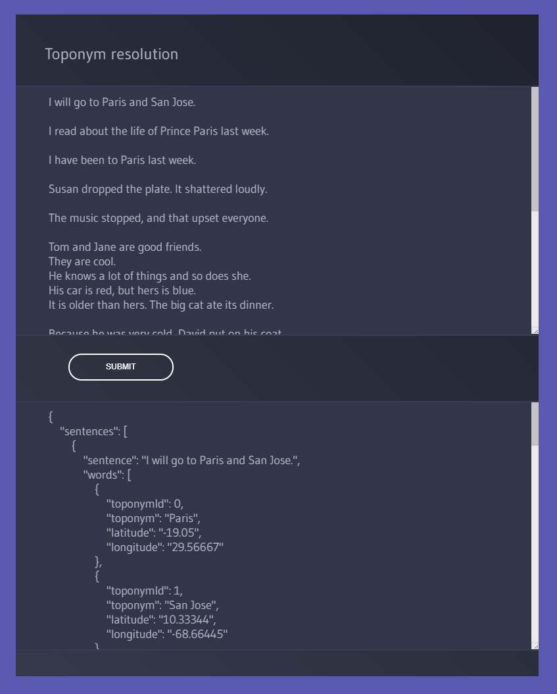

# Toponym resolution in scientific papaers

## Project description

Toponym resolution, also known as geoparsing, geo-grounding or place name resolution, aims to assign geographic coordinates to all location names mentioned in documents. Toponym resolution is usually performed in two independent steps. First, toponym detection or geotagging, where the span of place names mentioned in a document is noted. Second, toponym disambiguation or geocoding, where each name found is mapped to latitude and longitude coordinates corresponding to the centroid of its physical location. Toponym detection has been extensively studied in named entity recognition; location names were one of the first classes of named entities to be detected in text [Piskorski & Yangarber, 2013]. Disambiguation of toponyms is a more recent task [Leidner, 2007].